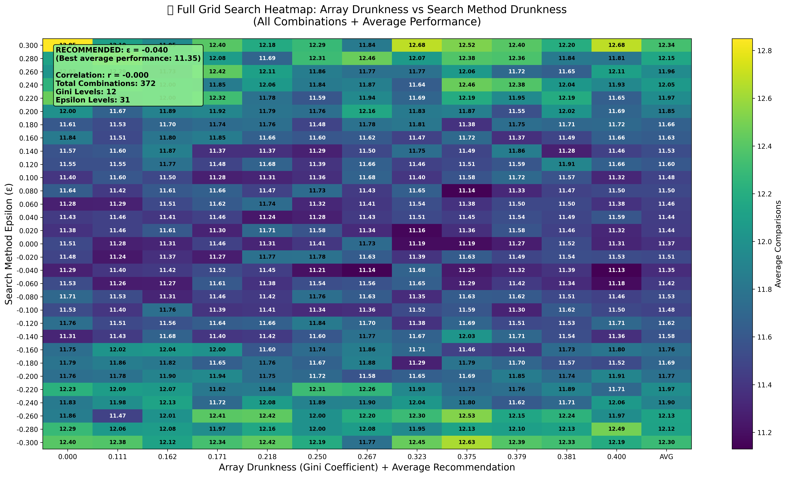

# [Epsilon Drunk Binary Search Analysis](https://claude.ai/share/4f46628e-e553-418d-bb7c-3dfa742d1e93)

A comprehensive study of the "Balmer Peak" phenomenon in binary search algorithms, where introducing controlled randomness (epsilon) can improve performance on certain array structures.

## Overview

This project implements and analyzes **Epsilon Drunk Binary Search**, a modified binary search algorithm that uses `0.5 + ε` instead of `0.5` for the midpoint calculation, where ε is a small random offset. The research explores how different array structures (characterized by their Gini coefficient) respond to different levels of search "drunkness."

## Key Concepts

### Epsilon Drunk Binary Search
- **Standard binary search**: Uses exact midpoint `mid = (low + high) / 2`
- **Drunk binary search**: Uses perturbed midpoint `mid = low + (high - low) * (0.5 + ε)`
- **Epsilon (ε)**: Random offset in range `[-ε_max, +ε_max]`
  - Negative ε = "undershoot" (bias toward lower indices)
  - Positive ε = "overshoot" (bias toward higher indices)

### Array Drunkness (Gini Coefficient)
The [**Gini coefficient**](https://en.wikipedia.org/wiki/Gini_coefficient) is a statistical measure of inequality originally used in economics to measure income distribution. In our context, we apply it to measure the inequality in gap distributions between consecutive array elements.

- **Sober arrays**: Perfectly even spacing between elements (Gini = 0.000)
- **Drunk arrays**: Uneven gap distributions with some large and small gaps (higher Gini values)
- **Mathematical definition**: For gaps g₁, g₂, ..., gₙ:
  ```
  Gini = (2 × Σᵢ(i × gᵢ)) / (n × Σᵢ(gᵢ)) - (n+1)/n
  ```
- **Why we use it**: The Gini coefficient provides a single, intuitive metric (0-1 scale) to characterize how "uneven" or "drunk" an array's structure is, allowing us to systematically study performance across different data distributions.

### Balmer Peak
The [**Balmer Peak**](https://en.wikipedia.org/wiki/Ballmer_peak) is a programming folklore concept suggesting that there's an optimal level of alcohol consumption that maximizes programming productivity - too little and you're overly cautious, too much and you make mistakes.

We apply this concept metaphorically to binary search:
- **Too sober** (ε = 0): Deterministic but potentially suboptimal on uneven data
- **Optimal drunkness** (small ε): Just enough randomness to improve performance  
- **Too drunk** (large ε): Excessive randomness hurts performance

Our research seeks to find the "Balmer Peak" epsilon value that minimizes average comparisons for each array structure.

## Project Structure

```
epsilon-drunk-binary-search/
├── main.py                 # Core analysis and grid search
├── plot_results.py         # Visualization and plotting
├── requirements.txt        # Python dependencies
├── README.md              # This file
├── epsilon_drunk_search_results.csv  # Generated results
└── plots/                 # Generated visualizations
    ├── array_vs_method_drunkness_correlation.png
    ├── epsilon_drunk_search_summary.png
    └── balmer_peak_*.png  # Individual scenario plots
```

## Usage

### Installation
```bash
pip install -r requirements.txt
```

### Running the Analysis
```bash
# Generate comprehensive grid search data
python3 main.py

# Generate all plots and visualizations
python3 plot_results.py
```

### Customization
Modify `main.py` to adjust:
- **Gini levels**: Change `gini_levels = [0.0, 0.05, 0.1, ...]`
- **Epsilon range**: Modify `epsilon_values = np.arange(-0.3, 0.31, 0.02)`
- **Array size**: Adjust `arr_size = 5000`
- **Trials per combination**: Change `num_trials = 100`

## Key Algorithms

### Array Generation
```python
def generate_array_with_gini(size: int, target_gini: float) -> List[int]:
    """Generate array targeting specific Gini coefficient for gap distribution."""
    # Uses deterministic gap distribution to achieve target inequality
```

### Drunk Binary Search
```python
def drunk_binary_search(arr: List[int], target: int, epsilon_range: float) -> Tuple[int, int]:
    """Binary search with random epsilon offset from 0.5 midpoint."""
    epsilon = random.uniform(-epsilon_range, epsilon_range)
    drunk_ratio = max(0.1, min(0.9, 0.5 + epsilon))
    mid = int(low + (high - low) * drunk_ratio)
```

### Performance Analysis
- **Statistical testing**: t-tests for significance
- **Confidence intervals**: 95% CI for performance metrics
- **Grid search**: Systematic exploration of parameter space

## Statistical Methodology (For Nerds 🤓)

### Experimental Design
- **Trials per combination**: 100 independent searches
- **Array size**: 5,000 elements per test array
- **Target selection**: Random targets uniformly distributed across array indices
- **Statistical tests**: Two-tailed t-tests comparing drunk vs. regular binary search

### Performance Metrics
- **Primary metric**: Average number of comparisons
- **Confidence intervals**: 95% CI using t-distribution
- **Standard deviation**: Sample standard deviation across trials
- **Statistical significance**: p < 0.05 threshold
- **Effect size**: Percentage improvement over regular binary search

### Example Statistical Output
```
Regular binary search: 11.72 ± 1.33 comparisons
Best drunk search: 11.14 ± 1.66 comparisons  
95% CI: [10.81, 11.47]
Improvement: 4.95%
Statistical significance: YES (p = 0.0070)
```

## Results

### Grid Search Dimensions
- **12 Array Types**: Gini coefficients from 0.000 to 0.600
- **31 Search Strategies**: Epsilon from -0.30 to +0.30 in steps of 0.02
- **372 Total Combinations**: 100 trials each = **37,200 individual searches**
- **Total data points**: 372 statistical measurements with full CI analysis

### Sample Performance Plot
_comparisons.png)

*Example showing the Balmer Peak for arrays with Gini coefficient 0.2. The plot demonstrates how performance varies across different epsilon values, with the optimal "drunk" level clearly visible as the minimum point.*

### Comprehensive Heatmap


*The main result: a 31×12 heatmap showing all 372 parameter combinations. Each cell represents the average performance (number of comparisons) for a specific Array Gini coefficient (x-axis) and Search epsilon level (y-axis). Darker colors indicate better performance.*

### Key Findings

1. **Array Structure Matters**: Different Gini coefficients favor different epsilon strategies
2. **Optimal Zones**: Performance peaks around ε ≈ ±0.04 to ±0.08
3. **Non-linear Relationship**: Complex interaction between array structure and search strategy
4. **Statistical Significance**: Multiple combinations show measurable improvements (p < 0.05)
5. **Performance Range**: 0.1-5% improvements in comparison count for optimal combinations

## Dependencies

- `numpy>=1.21.0` - Numerical computations
- `scipy>=1.7.0` - Statistical analysis
- `matplotlib>=3.5.0` - Plotting
- `pandas>=1.3.0` - Data manipulation
- `scikit-learn>=1.0.0` - Regression analysis
- `tqdm>=4.64.0` - Progress bars

## Scientific Background

This research is inspired by:
- **Randomized algorithms**: How controlled randomness can improve deterministic algorithms
- **Balmer Peak hypothesis**: Optimal performance with slight impairment
- **Binary search variants**: Adaptations for non-uniform data distributions
- **Performance analysis**: Statistical methods for algorithm comparison

## Interpretation

### When Drunk Search Helps
- **Clustered data**: Arrays with uneven element distribution
- **Skewed searches**: When targets aren't uniformly distributed
- **Cache effects**: Slight randomness may improve memory access patterns

### When Standard Search is Better
- **Uniform data**: Perfectly spaced arrays (Gini ≈ 0)
- **Large epsilon**: Excessive randomness hurts performance
- **Small arrays**: Overhead outweighs benefits

## Future Work

- **Real-world datasets**: Test on actual data distributions
- **Cache analysis**: Measure memory hierarchy effects
- **Adaptive epsilon**: Dynamic adjustment based on array characteristics
- **Multi-dimensional search**: Extension to higher-dimensional spaces
- **Theoretical analysis**: Mathematical modeling of performance bounds

## License

MIT License

Copyright (c) 2024 Epsilon Drunk Binary Search Analysis

Permission is hereby granted, free of charge, to any person obtaining a copy of this software and associated documentation files (the "Software"), to deal in the Software without restriction, including without limitation the rights to use, copy, modify, merge, publish, distribute, sublicense, and/or sell copies of the Software, and to permit persons to whom the Software is furnished to do so, subject to the following conditions:

The above copyright notice and this permission notice shall be included in all copies or substantial portions of the Software.

THE SOFTWARE IS PROVIDED "AS IS", WITHOUT WARRANTY OF ANY KIND, EXPRESS OR IMPLIED, INCLUDING BUT NOT LIMITED TO THE WARRANTIES OF MERCHANTABILITY, FITNESS FOR A PARTICULAR PURPOSE AND NONINFRINGEMENT. IN NO EVENT SHALL THE AUTHORS OR COPYRIGHT HOLDERS BE LIABLE FOR ANY CLAIM, DAMAGES OR OTHER LIABILITY, WHETHER IN AN ACTION OF CONTRACT, TORT OR OTHERWISE, ARISING FROM, OUT OF OR IN CONNECTION WITH THE SOFTWARE OR THE USE OR OTHER DEALINGS IN THE SOFTWARE.

## Citation

If you use this work in research, please cite:

```bibtex
@software{epsilon_drunk_binary_search,
  title = {Epsilon Drunk Binary Search Analysis},
  author = {Souradeep Nanda},
  year = {2025},
  url = {https://github.com/Ghost---Shadow/epsilon-drunk-binary-search},
  note = {A study of randomized binary search performance across array structures}
}
```

**GitHub Repository**: https://github.com/Ghost---Shadow/epsilon-drunk-binary-search

---

*"In code, as in life, sometimes a little randomness leads to better outcomes."*